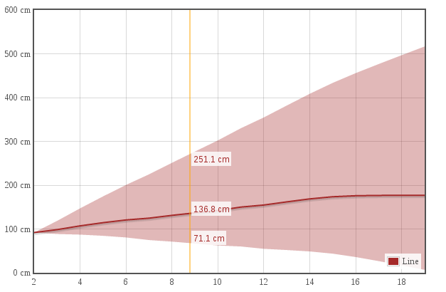

Flotneedle
===

###Overview

This plugin is used to append tooltips at the current mouse position on the canvas element where the flot graph is drawn. Flotneedle is a plugin to be used with the [flot](http://www.flotcharts.org) graphing library. Jquery is a dependency of flot so it is also a dependency of flotneedle. Flotneedle supports stacked and fillarea graphs.

Example screenshot:



###Configuration

In order for flotneedle to work properly the plot option for grid must have its hoverable property set to true.

Flotneedle can be customized with a number of options all scoped to the option called needle:

* on: Toggles flotneedle on and off, accepts a boolean
* noduplicates: Toggles whether fillarea graphs' tooltips with the same data values will be displayed or not, accepts a boolean
* fontSize: Sets the font size of the tooltip text
* fontFace: Sets the font face of the tooltip text
* lineWidth: Sets the width of the crosshair, in px
* lineColor: Sets the color of the crosshair, accepts rgba, hex, and css colors
* x_tooltip: Toggles a display of the x-value, accepts a boolean or an object with key 'formatX' that is assigned a callback that will format the text displayed in the x_tooltip 

Flotneedle also supports labelling for the tooltips all that is needed is for a needle option to be set in the dataset with a callback assigned to the key called label. Example below:

```javascript
var dataset = [
  {
    data: data,
    needle: {
      label: function(num){
        return num + ' cm';
      },
      x_tooltip: {
      		formatX: function(x) {
      			return Math.log(x);
      		}
  		}
    }
  }
];
```
