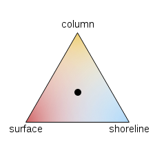

Relative Importance
===

This is a canvas widget that allows the user to assign importance between three distinct quantities.

###How to install

####Use bower

If you are using bower with your project simply run this command:

     bower install relativeimportance

####Clone this repo

Just clone this repo and manually include it in your project.

###How to configure

This widget contains a class called Triangle which its constructor takes two args. The first arg is the id selector for the canvas element you want the triangle to be in. The second arg is an options hash that will allow you to configure and customize the triangle you want drawn.

The options available for the options hash are:

* sideLength: Sets how long each side will be in terms of pixels
* point1: {label: Labels the first point which is the top point, color: Color of the point's radial gradient}
* point2: {label: Labels the second point which is in the lower left, color: Color of the point's radial gradient}
* point3: {label: Labels the third point which is in the lower right, color: Color of the point's radial gradient}
* callback: Function that gets the distance percents passed in as the first parameter

####Example with picture

The code below would generate the following widget in a canvas element with an id of "tutorial", where its width and height are both set at 300px.

     var triangle = new Triangle('tutorial', {sideLength: 200, point1: {label: 'column', color: '#EDC240'}, point2: {label: 'surface', color: '#CB4B4B'}, point3: {label: 'shoreline', color: '#AFD8F8'}, callback: dataOutputter});
     triangle.draw();

